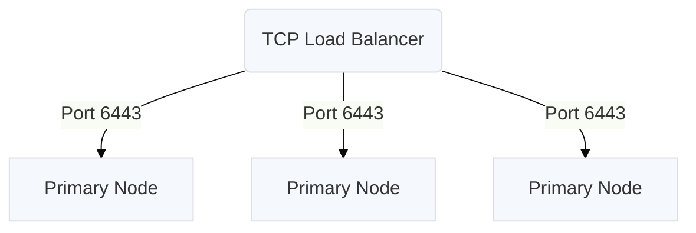

## Supported Operating Systems

* Ubuntu 18.04
* Ubuntu 20.04 (Docker version >= 19.03.10)
* Ubuntu 22.04 (Requires Containerd version >= 1.5.10 or Docker version >= 20.10.17. Collectd add-ons are not supported.)
* CentOS 7.4\*, 7.5\*, 7.6\*, 7.7\*, 7.8\*, 7.9, 8.0\*, 8.1\*, 8.2\*, 8.3\*, 8.4\* (CentOS 8.x requires Containerd)
* RHEL 7.4\*, 7.5\*, 7.6\*, 7.7\*, 7.8\*, 7.9, 8.0\*, 8.1, 8.2, 8.3, 8.4, 8.5, 8.6 (RHEL 8.x requires Containerd)
* Oracle Linux 7.4\*, 7.5\*, 7.6\*, 7.7\*, 7.8\*, 7.9, 8.0\*, 8.1, 8.2, 8.3, 8.4, 8.5, 8.6 (OL 8.x requires Containerd)
* Amazon Linux 2

*: This version is deprecated since it is no longer supported by its creator. We continue to support it, but support will be removed in the future.

## Minimum System Requirements

* 4 AMD64 CPUs or equivalent per machine
* 8 GB of RAM per machine
* 40 GB of Disk Space per machine. 
    * **Note**: When [Rook](/docs/add-ons/rook) is enabled, 10GB of the total 40GB should be available to `/var/lib/rook`
* TCP ports 2379, 2380, 10250, 10251 and 10252 open between cluster nodes
    * **Note**: When [Flannel](/docs/add-ons/flannel) is enabled, UDP port 8472 open between cluster nodes
    * **Note**: When [Weave](/docs/add-ons/weave) is enabled, TCP ports 6443 and 6783 and UDP ports 6783 and 6784 open between cluster nodes

## kURL Dependencies Directory

kURL will install additional dependencies in the directory /var/lib/kurl/.
These dependencies include utilities as well as system packages and container images.
This directory must be writeable by the kURL installer and must have sufficient disk space (5 GB).
This directory can be overridden with the flag `kurl-install-directory`.
For more information see [kURL Advanced Install Options](/docs/install-with-kurl/advanced-options).
## Networking Requirements
### Firewall Openings for Online Installations

The following domains need to be accessible from servers performing online kURL installs. 
IP addresses for these services can be found in [replicatedhq/ips](https://github.com/replicatedhq/ips/blob/master/ip_addresses.json).

| Host          | Description                                                                                                                                                                                                                                                                                      |
|---------------|--------------------------------------------------------------------------------------------------------------------------------------------------------------------------------------------------------------------------------------------------------------------------------------------------|
| amazonaws.com | tar.gz packages are downloaded from Amazon S3 during embedded cluster installations. The IP ranges to allowlist for accessing these can be scraped dynamically from the [AWS IP Address](https://docs.aws.amazon.com/general/latest/gr/aws-ip-ranges.html#aws-ip-download) Ranges documentation. |
| k8s.gcr.io   | Images for the Kubernetes control plane are downloaded from the [Google Container Registry](https://cloud.google.com/container-registry) repository used to publish official container images for Kubernetes. For more information on the Kubernetes control plane components, see the [Kubernetes documentation](https://kubernetes.io/docs/concepts/overview/components/#control-plane-components). |
| k8s.kurl.sh   | Kubernetes cluster installation scripts and artifacts are served from [kurl.sh](https://kurl.sh). Bash scripts and binary executables are served from kurl.sh. This domain is owned by Replicated, Inc which is headquartered in Los Angeles, CA. |

No outbound internet access is required for airgapped installations.
### Host Firewall Rules

The kURL install script will prompt to disable firewalld. 
Note that firewall rules can affect communications between containers on the **same** machine, so it is recommended to disable these rules entirely for Kubernetes.
Firewall rules can be added after or preserved during an install, but because installation parameters like pod and service CIDRs can vary based on local networking conditions, there is no general guidance available on default requirements. 
See [Advanced Options](/docs/install-with-kurl/advanced-options) for installer flags that can preserve these rules.

The following ports must be open between nodes for multi-node clusters:

#### Primary Nodes:

| Protocol | Direction | Port Range | Purpose                 | Used By |
| -------  | --------- | ---------- | ----------------------- | ------- |
| TCP      | Inbound   | 6443       | Kubernetes API server   | All     |
| TCP      | Inbound   | 2379-2380  | etcd server client API  | Primary |
| TCP      | Inbound   | 10250      | kubelet API             | Primary |
| UDP      | Inbound   | 8472       | Flannel VXLAN           | All     |
| TCP      | Inbound   | 6783       | Weave Net control       | All     |
| UDP      | Inbound   | 6783-6784  | Weave Net data          | All     |

#### Secondary Nodes:

| Protocol | Direction | Port Range | Purpose                 | Used By |
| -------  | --------- | ---------- | ----------------------- | ------- |
| TCP      | Inbound   | 10250      | kubelet API             | Primary |
| UDP      | Inbound   | 8472       | Flannel VXLAN           | All     |
| TCP      | Inbound   | 6783       | Weave Net control       | All     |
| UDP      | Inbound   | 6783-6784  | Weave Net data          | All     |

These ports are required for [Kubernetes](https://kubernetes.io/docs/setup/production-environment/tools/kubeadm/install-kubeadm/#control-plane-node-s) and [Weave Net](https://www.weave.works/docs/net/latest/faq/#ports).

### Ports Available

In addition to the ports listed above that must be open between nodes, the following ports should be available on the host for components to start TCP servers accepting local connections.

| Port | Purpose                 |
| ---- | ----------------------- |
| 2381 | etcd health and metrics server |
| 6781 | [weave](/docs/add-ons/weave) network policy controller metrics server |
| 6782 | [weave](/docs/add-ons/weave) metrics server |
| 10248 | kubelet health server |
| 10249 | kube-proxy metrics server |
| 9100 | [prometheus](/docs/add-ons/prometheus) node-exporter metrics server |
| 10257 | kube-controller-manager health server |
| 10259 | kube-scheduler health server |

## High Availability Requirements

In addition to the networking requirements described in the previous section, operating a cluster with high availability adds additional constraints.

### Control Plane HA

To operate the Kubernetes control plane in HA mode, it is recommended to have a minimum of 3 primary nodes. 
In the event that one of these nodes becomes unavailable, the remaining two will still be able to function with an etcd quorom. 
As the cluster scales, dedicating these primary nodes to control-plane only workloads using the `noSchedule` taint should be considered.
This will affect the number of nodes that need to be provisioned.

### Worker Node HA

The number of required secondary nodes is primarily a function of the desired application availability and throughput.
By default, primary nodes in kURL also run application workloads. 
At least 2 nodes should be used for data durability for applications that use persistent storage (i.e. databases) deployed in-cluster.

### Load Balancers

Highly available cluster setups that do not leverage EKCO's [internal load balancing capability](/docs/add-ons/ekco#internal-load-balancer) require a load balancer to route requests to healthy nodes. 
The following requirements need to be met for load balancers used on the control plane (primary nodes):
1. The load balancer must be able to route TCP traffic, as opposed to Layer 7/HTTP traffic.
1. The load balancer must support hairpinning, i.e. nodes referring to eachother through the load balancer IP.
    * **Note**: On AWS, only internet-facing Network Load Balancers (NLBs) and internal AWS NLBs **using IP targets** (not Instance targets) support this.  
1. Load balancer health checks should be configured using TCP probes of port 6443 on each primary node.
1. The load balancer should target each primary node on port 6443.
1. In accordance with the above firewall rules, port 6443 should be open on each primary node.

The IP or DNS name and port of the load balancer should be provided as an argument to kURL during the HA setup. 
See [Highly Available K8s](/docs/install-with-kurl/#highly-available-k8s-ha) for more install information.

For more information on configuring load balancers in the public cloud for kURL installs see [Public Cloud Load Balancing](/docs/install-with-kurl/public-cloud-load-balancing).

Load balancer requirements for application workloads vary depending on workload.

## Cloud Disk Performance

The following example cloud VM instance/disk combinations are known to provide sufficient performance for etcd and will pass the write latency preflight.

* AWS m4.xlarge with 80 GB standard EBS root device
* Azure D4ds_v4 with 8 GB ultra disk mounted at /var/lib/etcd provisioned with 2400 IOPS and 128 MB/s throughput
* Google Cloud Platform n1-standard-4 with 50 GB pd-ssd boot disk
* Google Cloud Platform  n1-standard-4 with 500 GB pd-standard boot disk
