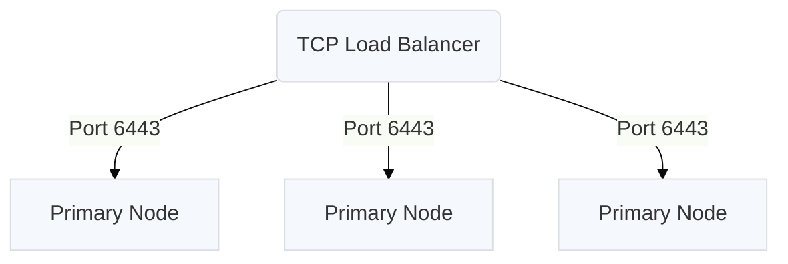

## Supported Operating Systems

* Ubuntu 18.04
* Ubuntu 20.04 (Docker version >= 19.03.10)
* Ubuntu 22.04 (Requires Containerd version >= 1.5.10 or Docker version >= 20.10.17. Collectd add-ons are not supported.)
* CentOS 7.4<sup>\*</sup>, 7.5<sup>\*</sup>, 7.6<sup>\*</sup>, 7.7<sup>\*</sup>, 7.8<sup>\*</sup>, 7.9, 8.0<sup>\*</sup>, 8.1<sup>\*</sup>, 8.2<sup>\*</sup>, 8.3<sup>\*</sup>, 8.4<sup>\*</sup> (CentOS 8.x requires Containerd)
* RHEL 7.4<sup>\*</sup>, 7.5<sup>\*</sup>, 7.6<sup>\*</sup>, 7.7<sup>\*</sup>, 7.8<sup>\*</sup>, 7.9, 8.0<sup>\*</sup>, 8.1, 8.2, 8.3, 8.4, 8.5, 8.6, 8.7, 9.0, 9.1 (RHEL 8.x and 9.x require Containerd)
* Rocky Linux 9.0, 9.1, 9.2 (Rocky Linux 9.x requires Containerd)
* Oracle Linux 7.4<sup>\*</sup>, 7.5<sup>\*</sup>, 7.6<sup>\*</sup>, 7.7<sup>\*</sup>, 7.8<sup>\*</sup>, 7.9, 8.0<sup>\*</sup>, 8.1, 8.2, 8.3, 8.4, 8.5, 8.6, 8.7 (OL 8.x requires Containerd)
* Amazon Linux 2

*&ast; This version is deprecated since it is no longer supported by its creator. We continue to support it, but support will be removed in the future.*

## Minimum System Requirements

* 4 AMD64 CPUs or equivalent per machine
* 8 GB of RAM per machine
* 100 GB of Disk Space per machine
  *(For more specific requirements see [Disk Space Requirements](#disk-space-requirements) below)*
* TCP ports 2379, 2380, 6443, 10250, 10257 and 10259 and UDP port 8472 (Flannel VXLAN) open between cluster nodes
  *(For more specific add-on requirements see [Networking Requirements](#networking-requirements) below)*

## Host Package Requirements

Host packages are bundled and installed by kURL without the need for external package repositories except for in the case of Red Hat Enterprise Linux 9 and Rocky Linux 9.

For these OSes, the following packages are required per add-on:

| Add-on                           | Packages |
| -------------------------------- | -------- |
| * kURL Core                      | curl openssl tar |
| Collectd                         | bash glibc libcurl libcurl-minimal libgcrypt libgpg-error libmnl openssl-libs rrdtool systemd systemd-libs yajl |
| Containerd                       | bash libseccomp libzstd systemd |
| Kubernetes                       | conntrack-tools ethtool glibc iproute iptables-nft socat util-linux                     |
| Longhorn                         | iscsi-initiator-utils nfs-utils |
| OpenEBS *\*versions 1.x and 2.x* | iscsi-initiator-utils |
| Rook                             | lvm2 |
| Velero                           | nfs-utils |

## Disk Space Requirements

### Core Requirements

The following table lists information about the core directory requirements.

| Name           | Location             | Requirements       | Description |
| -------------- | -------------------- | ------------------ | ----------- |
| etcd           | /var/lib/etcd/       | 2 GB               | Kubernetes etcd cluster data directory. See the [etcd documentation](https://etcd.io/docs/v3.5/op-guide/hardware/#disks) and [Cloud Disk Performance](#cloud-disk-performance) for more information and recommendations. |
| kubelet        | /var/lib/kubelet/    | *30 GB &ast;*      | Used for local disk volumes, emptyDir, log storage, and more. See the Kubernetes [Resource Management for Pods and Containers documentation](https://kubernetes.io/docs/concepts/configuration/manage-resources-containers/#local-ephemeral-storage) for more information.  |
| containerd     | /var/lib/containerd/ | *30 GB &ast;*      | Snapshots, content, metadata for containers and image, as well as any plugin data will be kept in this location. See the [containerd documentation](https://github.com/containerd/containerd/blob/main/docs/ops.md#base-configuration) for more information. |
| kube-apiserver | /var/log/apiserver/  | 1 GB               | Kubernetes audit logs. See Kubernetes [Auditing documentation](https://kubernetes.io/docs/tasks/debug/debug-cluster/audit/) for mode information. |
| kURL           | /var/lib/kurl/       | *10 GB &ast;&ast;* | kURL data directory used to store utilities, system packages, and container images. This directory can be overridden with the flag `kurl-install-directory` (see [kURL Advanced Install Options](/docs/install-with-kurl/advanced-options)) |
| Root Disk      | /                    | 100 GB             | Based on the aggregate requirements above and the fact that Kubernetes will start to reclaim space at 85% full disk, the minimum recommended root partition is 100 GB. See details above for each component. |

*&ast; This requirement depends on the size of the container images and the amount of ephemeral data used by your application containers.*

*&ast;&ast; This requirement can vary depending on your choice of kURL add-ons and can grow over time.*

In addition to the storage requirements, the Kubernetes [garbage collection](https://kubernetes.io/docs/concepts/architecture/garbage-collection/) process attempts to ensure that the Node and Image filesystems do not reach their minimum available disk space [thresholds](https://kubernetes.io/docs/concepts/scheduling-eviction/node-pressure-eviction/#hard-eviction-thresholds) of 10% and 15% respectively.
For this reason, kURL recommends an additional 20% overhead on top of these disk space requirements for the volume or volumes containing the directories /var/lib/kubelet/ and /var/lib/containerd/.
For more information see the Kubernetes [Reclaiming node level resources](https://kubernetes.io/docs/concepts/scheduling-eviction/node-pressure-eviction/#reclaim-node-resources) documentation.

### Add-on Requirements

The following table lists the add-on directory locations and disk space requirements, if applicable. For any additional requirements, see the specific topic for the add-on.

| Name     | Location             | Requirements  | Description |
| -------- | -------------------- | ------------- | ----------- |
| Docker   | /var/lib/docker/     | *30 GB &ast;* | Images, containers and volumes, and more will be kept in this location. See the [Docker Storage documentation](https://docs.docker.com/storage/) for more information. When using the Docker runtime, /var/lib/containerd/ is not required. |
| Docker   | /var/lib/dockershim/ | N/A           | Kubernetes dockershim data directory |
| Weave    | /var/lib/cni/        | N/A           | Container networking data directory |
| Weave    | /var/lib/weave/      | N/A           | Weave data directory |
| Rook     | /var/lib/rook/       | 10 GB         | Ceph monitor metadata directory. See the [ceph-mon Minimum Hardware Recommendations](https://docs.ceph.com/en/quincy/start/hardware-recommendations/#minimum-hardware-recommendations) for more information. |
| Registry | *PVC &ast;&ast;*     | N/A           | Stores container images only in airgapped clusters. Data will be stored in Persistent Volumes. |
| Velero   | *PVC &ast;&ast;*     | N/A           | Stores snapshot data. Data will be stored in Persistent Volumes. |

*&ast; This requirement depends on the size of the container images and the amount of ephemeral data used by your application containers.*

*&ast;&ast; Data will be stored in Persistent Volumes. Requirements depend on the provisioner of choice. See [Persistent Volume Requirements](#persistent-volume-requirements) for more information.*

### Persistent Volume Requirements

Depending on the amount of persistent data stored by your application, you will need to allocate enough disk space at the following location dependent on your PVC provisioner or provisioners.

| Name                 | Location              | Description |
| -------------------- | --------------------- | ----------- |
| OpenEBS              | /var/openebs/local/   | OpenEBS Local PV Hostpath volumes will be created under this directory. See the [OpenEBS Add-on](/docs/add-ons/openebs) documentation for more information. |
| Rook (Block Storage) |                       | Rook add-on version 1.4.3 and later requires an unformatted storage device on each node in the cluster for Ceph volumes. See the [Rook Block Storage](/docs/add-ons/rook#block-storage) documentation for more information. |
| Rook (version 1.0.x) | /opt/replicated/rook/ | Rook Filesystem volumes will be created under this directory. See the [Rook Filesystem Storage](/docs/add-ons/rook#filesystem-storage) documentation for more information. |
| Longhorn             | /var/lib/longhorn/    | Longhorn volumes will be created under this directory. See the [Longhorn Add-on](/docs/add-ons/longhorn) documentation for more information. |

## Networking Requirements

### Hostnames, DNS, and IP Address

The fully-qualified domain name (FQDN) of any host used with kURL must be a valid DNS subdomain name, and its name must be resolvable by DNS.
For more information, see [DNS Subdomain Names](https://kubernetes.io/docs/concepts/overview/working-with-objects/names/#dns-subdomain-names) in the Kubernetes documentation.

After a host is added to a Kubernetes cluster, Kubernetes assumes that the hostname and IP address of the host will not change.
If you need to change the hostname or IP address of a node, you must first remove the node from the cluster.

To change the hostname or IP address of a node in clusters that do not have three or more nodes, use snapshots to move the application to a new cluster before you attempt to remove the node. For more information about using snapshots, see [Velero Add-on](/add-ons/velero).

For more information about the requirements for naming nodes, see [Node naming uniqueness](https://kubernetes.io/docs/concepts/architecture/nodes/#node-name-uniqueness) in the Kubernetes documentation.

### Firewall Openings for Online Installations

The following domains need to be accessible from servers performing online kURL installs.
IP addresses for these services can be found in [replicatedhq/ips](https://github.com/replicatedhq/ips/blob/master/ip_addresses.json).

| Host          | Description                                                                                                                                                                                                                                                                                      |
|---------------|--------------------------------------------------------------------------------------------------------------------------------------------------------------------------------------------------------------------------------------------------------------------------------------------------|
| amazonaws.com | tar.gz packages are downloaded from Amazon S3 during embedded cluster installations. The IP ranges to allowlist for accessing these can be scraped dynamically from the [AWS IP Address](https://docs.aws.amazon.com/general/latest/gr/aws-ip-ranges.html#aws-ip-download) Ranges documentation. |
| k8s.gcr.io, registry.k8s.io | Images for the Kubernetes control plane are downloaded from the [Google Container Registry](https://cloud.google.com/container-registry) repository used to publish official container images for Kubernetes. Starting March 20, 2023, these requests are proxied to the new address `registry.k8s.io`. Both of these URLs must be allowed network traffic using firewall rules. For more information on the Kubernetes control plane components, see the [Kubernetes documentation](https://kubernetes.io/docs/concepts/overview/components/#control-plane-components). |
| k8s.kurl.sh, s3.kurl.sh   | Kubernetes cluster installation scripts and artifacts are served from [kurl.sh](https://kurl.sh). Bash scripts and binary executables are served from kurl.sh. This domain is owned by Replicated, Inc which is headquartered in Los Angeles, CA. |

No outbound internet access is required for airgapped installations.
### Host Firewall Rules

The kURL install script will prompt to disable firewalld.
Note that firewall rules can affect communications between containers on the **same** machine, so it is recommended to disable these rules entirely for Kubernetes.
Firewall rules can be added after or preserved during an install, but because installation parameters like pod and service CIDRs can vary based on local networking conditions, there is no general guidance available on default requirements.
See [Advanced Options](/docs/install-with-kurl/advanced-options) for installer flags that can preserve these rules.

The following ports must be open between nodes for multi-node clusters:

#### Primary Nodes:

| Protocol | Direction | Port Range | Purpose                      | Used By |
| -------  | --------- | ---------- | ---------------------------- | ------- |
| TCP      | Inbound   | 6443       | Kubernetes API server        | All     |
| TCP      | Inbound   | 2379-2380  | etcd server client API       | Primary |
| TCP      | Inbound   | 10250      | kubelet API                  | Primary |
| UDP      | Inbound   | 8472       | Flannel VXLAN                | All     |
| TCP      | Inbound   | 6783       | Weave Net control            | All     |
| UDP      | Inbound   | 6783-6784  | Weave Net data               | All     |
| TCP      | Inbound   | 9090       | Rook CSI RBD Plugin Metrics  | All     |

#### Secondary Nodes:

| Protocol | Direction | Port Range | Purpose                      | Used By |
| -------  | --------- | ---------- | ---------------------------- | ------- |
| TCP      | Inbound   | 10250      | kubelet API                  | Primary |
| UDP      | Inbound   | 8472       | Flannel VXLAN                | All     |
| TCP      | Inbound   | 6783       | Weave Net control            | All     |
| UDP      | Inbound   | 6783-6784  | Weave Net data               | All     |
| TCP      | Inbound   | 9090       | Rook CSI RBD Plugin Metrics  | All     |

These ports are required for [Kubernetes](https://kubernetes.io/docs/setup/production-environment/tools/kubeadm/install-kubeadm/#control-plane-node-s), [Flannel](https://github.com/flannel-io/flannel/blob/master/Documentation/backends.md#vxlan), and [Weave Net](https://www.weave.works/docs/net/latest/faq/#ports).

### Ports Available

In addition to the ports listed above that must be open between nodes, the following ports should be available on the host for components to start TCP servers accepting local connections.

| Port | Purpose                 |
| ---- | ----------------------- |
| 2381 | etcd health and metrics server |
| 6781 | [weave](/docs/add-ons/weave) network policy controller metrics server |
| 6782 | [weave](/docs/add-ons/weave) metrics server |
| 10248 | kubelet health server |
| 10249 | kube-proxy metrics server |
| 9100 | [prometheus](/docs/add-ons/prometheus) node-exporter metrics server |
| 10257 | kube-controller-manager health server |
| 10259 | kube-scheduler health server |

### Additional Firewall Rules

When using the Flannel CNI, to allow for outgoing TCP connections from pods, you must configure stateless packet filtering firewalls to allow all packets with TCP flags "ack" with destination port range 1024-65535.
For more information see the Flannel [Firewalls](/docs/add-ons/flannel#firewalls) add-on documentation.

```
| Name               | Source IP   | Destination IP | Source port | Destination port | Protocol | TCP flags | Action |
| ----               | ---------   | -------------- | ----------- | ---------------- | -------- | --------- | ------ |
| Allow outgoing TCP | 0.0.0.0/0   | 0.0.0.0/0      | 0-65535     | 1024-65535       | tcp      | ack       | accept |
```


## High Availability Requirements

In addition to the networking requirements described in the previous section, operating a cluster with high availability adds additional constraints.

### Control Plane HA

To operate the Kubernetes control plane in HA mode, it is recommended to have a minimum of 3 primary nodes.
In the event that one of these nodes becomes unavailable, the remaining two will still be able to function with an etcd quorum.
As the cluster scales, dedicating these primary nodes to control-plane only workloads using the `noSchedule` taint should be considered.
This will affect the number of nodes that need to be provisioned.

### Worker Node HA

The number of required secondary nodes is primarily a function of the desired application availability and throughput.
By default, primary nodes in kURL also run application workloads.
At least 2 nodes should be used for data durability for applications that use persistent storage (i.e. databases) deployed in-cluster.

### Load Balancers



Highly available cluster setups that do not leverage EKCO's [internal load balancing capability](/docs/add-ons/ekco#internal-load-balancer) require a load balancer to route requests to healthy nodes.
The following requirements need to be met for load balancers used on the control plane (primary nodes):
1. The load balancer must be able to route TCP traffic, as opposed to Layer 7/HTTP traffic.
1. The load balancer must support hairpinning, i.e. nodes referring to each other through the load balancer IP.
    * **Note**: On AWS, only internet-facing Network Load Balancers (NLBs) and internal AWS NLBs **using IP targets** (not Instance targets) support this.<br /><br />
1. Load balancer health checks should be configured using TCP probes of port 6443 on each primary node.
1. The load balancer should target each primary node on port 6443.
1. In accordance with the above firewall rules, port 6443 should be open on each primary node.

The IP or DNS name and port of the load balancer should be provided as an argument to kURL during the HA setup.
See [Highly Available K8s](/docs/install-with-kurl/#highly-available-k8s-ha) for more install information.

For more information on configuring load balancers in the public cloud for kURL installs see [Public Cloud Load Balancing](/docs/install-with-kurl/public-cloud-load-balancing).

Load balancer requirements for application workloads vary depending on workload.

## Cloud Disk Performance

The following example cloud VM instance/disk combinations are known to provide sufficient performance for etcd and will pass the write latency preflight.

* AWS m4.xlarge with 100 GB standard EBS root device
* Azure D4ds_v4 with 8 GB ultra disk mounted at /var/lib/etcd provisioned with 2400 IOPS and 128 MB/s throughput
* Google Cloud Platform n1-standard-4 with 100 GB pd-ssd boot disk
* Google Cloud Platform  n1-standard-4 with 500 GB pd-standard boot disk
