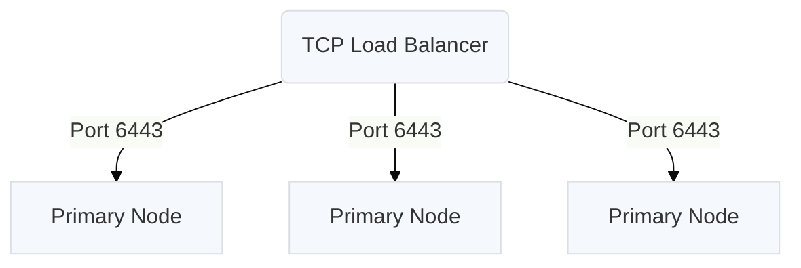

## Supported Operating Systems

* Ubuntu 18.04<sup>\*</sup>
* Ubuntu 20.04 (Requires Docker version >= 19.03.10)
* Ubuntu 22.04 (Requires Containerd version >= 1.5.10 or Docker version >= 20.10.17)
* Ubuntu 24.04 (Requires that the Containerd package be preinstalled on the host)
* CentOS 7.4<sup>\*</sup>, 7.5<sup>\*</sup>, 7.6<sup>\*</sup>, 7.7<sup>\*</sup>, 7.8<sup>\*</sup>, 7.9<sup>\*</sup>, 8.0<sup>\*</sup>, 8.1<sup>\*</sup>, 8.2<sup>\*</sup>, 8.3<sup>\*</sup>, 8.4<sup>\*</sup> (CentOS 8.x requires Containerd)
* RHEL 7.4<sup>\*</sup>, 7.5<sup>\*</sup>, 7.6<sup>\*</sup>, 7.7<sup>\*</sup>, 7.8<sup>\*</sup>, 7.9<sup>\*</sup>, 8.0<sup>\*</sup>, 8.1<sup>\*</sup>, 8.2<sup>\*</sup>, 8.3<sup>\*</sup>, 8.4<sup>\*</sup>, 8.5<sup>\*</sup>, 8.6, 8.7<sup>\*</sup>, 8.8, 8.9, 8.10, 9.0, 9.1<sup>\*</sup>, 9.2, 9.3, 9.4, 9.5 (RHEL 8.x and 9.x require Containerd)
* Rocky Linux 9.0<sup>\*</sup>, 9.1<sup>\*</sup>, 9.2, 9.3, 9.4, 9.5 (Rocky Linux 9.x requires Containerd)
* Oracle Linux 7.4<sup>\*</sup>, 7.5<sup>\*</sup>, 7.6<sup>\*</sup>, 7.7<sup>\*</sup>, 7.8<sup>\*</sup>, 7.9, 8.0<sup>\*</sup>, 8.1<sup>\*</sup>, 8.2<sup>\*</sup>, 8.3<sup>\*</sup>, 8.4<sup>\*</sup>, 8.5<sup>\*</sup>, 8.6<sup>\*</sup>, 8.7<sup>\*</sup>, 8.8<sup>\*</sup>, 8.9<sup>\*</sup>, 8.10 (OL 8.x requires Containerd)
* Amazon Linux 2
* Amazon Linux 2023 (Requires that the Containerd package be preinstalled on the host)

*&ast; This version is deprecated since it is no longer supported by its creator. We continue to support it, but support will be removed in the future.*

> Note: All nodes in a multi-node kURL cluster must use the same Linux distribution. Using different distributions across nodes is unsupported.

## Minimum System Requirements

* 4 AMD64 CPUs or equivalent per machine
* 8 GB of RAM per machine
* 256 GB of Disk Space per machine
  *(For more specific requirements see [Disk Space Requirements](#disk-space-requirements) below)*
* TCP ports 2379, 2380, 6443, 10250, 10257 and 10259 and UDP port 8472 (Flannel VXLAN) open between cluster nodes
  *(For more specific add-on requirements see [Networking Requirements](#networking-requirements) below)*

## Host Package Requirements

Host packages are bundled and installed by kURL without the need for external package repositories except for in the case of Red Hat Enterprise Linux 9, Rocky Linux 9, Amazon Linux 2023, and Ubuntu 24.04.

For these OSes, the following packages are required per add-on:

| Add-on                           | Packages |
| -------------------------------- | -------- |
| * kURL Core                      | curl openssl tar fio |
| Collectd                         | bash glibc libcurl libcurl-minimal libgcrypt libgpg-error libmnl openssl-libs rrdtool systemd systemd-libs yajl |
| Containerd                       | container-selinux bash libseccomp libzstd systemd |
| Kubernetes                       | conntrack-tools ethtool glibc iproute iptables-nft socat util-linux                     |
| Longhorn                         | iscsi-initiator-utils nfs-utils |
| OpenEBS *\*versions 1.x and 2.x* | iscsi-initiator-utils |
| Rook                             | lvm2 |
| Velero                           | nfs-utils |

Additionally, the containerd package is required for Containerd add-on installations on Amazon Linux 2023, Ubuntu 24.04, and any RHEL 9 version.

In general, the latest versions of the packages listed above are recommended for installation.
For instance, you do not need to match the version of the containerd package to the version of the containerd add-on.

## Disk Space Requirements

### Per Node Disk Space

256 GB of disk space per node is strongly recommended to accommodate growth and optimal performance. At minimum, kURL requires 100 GB of disk space per node.
It is important to note that disk usage can vary based on container image sizes, ephemeral data, and specific application requirements.

### Storage Provisioner Add-Ons

Informational Note: **OpenEBS** is configured to allocate its Persistent Volumes within the `/var/openebs/local/` directory, signifying that this specific location is utilized for the storage of data by applications that are actively running on the Kurl platform.

**Rook** add-on, starting from version 1.4.3, requires each node within the cluster to be equipped with an unformatted storage device, which is designated for the storage of Ceph volumes.
Comprehensive information and guidelines regarding this setup are available in the [Rook Block Storage](https://kurl.sh/docs/add-ons/rook#block-storage) documentation.
For Rook versions 1.0.x Persistent Volumes are provisioned on `/opt/replicated/rook/` directory.

### On Disk Partitioning

We advise against configuring the system with multiple mount points.
Experience has shown that utilizing distinct partitions for directories, such as `/var`, often leads to unnecessary complications.
Usage of *symbolic links* **is not recommended** in any scenario.

Should it be required, the directories utilized by the selected Storage Provisioner (for example, `/var/openebs/local` in the case of OpenEBS) can be set up to mount from a separate partition.
This configuration should be established **prior to the installation**. It's important to emphasize that Storage Provisioners are not compatible with *symbolic links*.

## Networking Requirements

### Hostnames, DNS, and IP Address

#### All hosts in the cluster must have valid DNS records and hostnames

The fully-qualified domain name (FQDN) of any host used with kURL **must** be a valid DNS subdomain name, and its name records **must** be resolvable by DNS.

A valid DNS name must:
- contain no more than 253 characters
- contain only lowercase alphanumeric characters, '-' or '.'
- start with an alphanumeric character
- end with an alphanumeric character

For more information, see [DNS Subdomain Names](https://kubernetes.io/docs/concepts/overview/working-with-objects/names/#dns-subdomain-names) in the Kubernetes documentation.


#### All hosts in the cluster must have static IP address assignments on a network interface that will be used for routing to containers

A host in a Kubernetes cluster must have a network interface that can be used for bridging traffic to Kubernetes pods.  In order for Pod traffic to work, the host must act as a Layer 3 router to route and switch packets to the right destination.  Therefore, a network interface should exist on the host (common names are `eth0`, `enp0s1`, etc.) with an IPv4 address & subnet in a publicly-routable or [private network ranges](https://en.wikipedia.org/wiki/Private_network), and [must be non-overlapping with the subnets used by Kubernetes](https://kubernetes.io/docs/concepts/cluster-administration/networking/#kubernetes-ip-address-ranges).  It must *not* be a [link-local address](https://en.wikipedia.org/wiki/Link-local_address#IPv4).

> Note: Removing the primary network interface on a node is *not* a supported configuration for deploying an airgap cluster.  An interface must exist for routing, so airgaps should be implemented "on the wire" - in the switch/router/VLAN configuration, by firewalls or network ACLs, or by physical disconnection.

After a host is added to a Kubernetes cluster, Kubernetes assumes that the hostname and IP address of the host **will not change.**
If you need to change the hostname or IP address of a node, you must first remove the node from the cluster.

To change the hostname or IP address of a node in clusters that do not have three or more nodes, use snapshots to move the application to a new cluster before you attempt to remove the node. For more information about using snapshots, see [Velero Add-on](/add-ons/velero).

For more information about the requirements for naming nodes, see [Node naming uniqueness](https://kubernetes.io/docs/concepts/architecture/nodes/#node-name-uniqueness) in the Kubernetes documentation.

#### All hosts in the cluster must not occupy Kubernetes Pod or Service CIDR ranges

Kubernetes also requires exclusive use of two IP subnets (also known as CIDR ranges) for Pod-to-Pod traffic within the cluster.  These subnets **must not** overlap with the subnets used in your local network or routing errors will result.

| Subnet       | Description                         |
|--------------|-------------------------------------|
| 10.96.0.0/16 | Kubernetes Service IPs              |
| 10.32.0.0/20 | [Flannel CNI Pod IPs](https://kurl.sh/docs/add-ons/flannel#custom-pod-subnet)                 |
| 10.10.0.0/16 | [Weave CNI (deprecated) Pod IPs](https://kurl.sh/docs/add-ons/weave#advanced-install-options)      |

These ranges can be customized by setting the appropriate add-on options directly in a kURL spec:
```yaml
spec:
    kubernetes:
      serviceCIDR: "<your custom subnet>"
    flannel:     
      podCIDR: "<your custom subnet>"
```

Alternatively, the ranges can be customized with a [patch file](https://kurl.sh/docs/install-with-kurl/#select-examples-of-using-a-patch-yaml-file).

### Firewall Openings for Online Installations

The following domains need to be accessible from servers performing online kURL installs.
IP addresses for these services can be found in [replicatedhq/ips](https://github.com/replicatedhq/ips/blob/master/ip_addresses.json).

| Host          | Description                                                                                                                                                                                                                                                                                      |
|---------------|--------------------------------------------------------------------------------------------------------------------------------------------------------------------------------------------------------------------------------------------------------------------------------------------------|
| amazonaws.com | tar.gz packages are downloaded from Amazon S3 during embedded cluster installations. The IP ranges to allowlist for accessing these can be scraped dynamically from the [AWS IP Address](https://docs.aws.amazon.com/general/latest/gr/aws-ip-ranges.html#aws-ip-download) Ranges documentation. |
| k8s.gcr.io, registry.k8s.io | Images for the Kubernetes control plane are downloaded from the [Google Container Registry](https://cloud.google.com/container-registry) repository used to publish official container images for Kubernetes. Starting March 20, 2023, these requests are proxied to the new address `registry.k8s.io`. Both of these URLs must be allowed network traffic using firewall rules. For more information on the Kubernetes control plane components, see the [Kubernetes documentation](https://kubernetes.io/docs/concepts/overview/components/#control-plane-components). |
| k8s.kurl.sh, s3.kurl.sh   | Kubernetes cluster installation scripts and artifacts are served from [kurl.sh](https://kurl.sh). Bash scripts and binary executables are served from kurl.sh. This domain is owned by Replicated, Inc which is headquartered in Los Angeles, CA. |

No outbound internet access is required for airgapped installations.
### Host Firewall Rules

The kURL install script will prompt to disable firewalld.
Note that firewall rules can affect communications between containers on the **same** machine, so it is recommended to disable these rules entirely for Kubernetes.
Firewall rules can be added after or preserved during an install, but because installation parameters like pod and service CIDRs can vary based on local networking conditions, there is no general guidance available on default requirements.
See [Advanced Options](/docs/install-with-kurl/advanced-options) for installer flags that can preserve these rules.

The following ports must be open between nodes for multi-node clusters:

#### Primary Nodes:

| Protocol | Direction | Port Range | Purpose                      | Used By |
| -------  | --------- | ---------- | ---------------------------- | ------- |
| TCP      | Inbound   | 6443       | Kubernetes API server        | All     |
| TCP      | Inbound   | 2379-2380  | etcd server client API       | Primary |
| TCP      | Inbound   | 10250      | kubelet API                  | Primary |
| UDP      | Inbound   | 8472       | Flannel VXLAN                | All     |
| TCP      | Inbound   | 6783       | Weave Net control            | All     |
| UDP      | Inbound   | 6783-6784  | Weave Net data               | All     |
| TCP      | Inbound   | 9090       | Rook CSI RBD Plugin Metrics  | All     |

#### Secondary Nodes:

| Protocol | Direction | Port Range | Purpose                      | Used By |
| -------  | --------- | ---------- | ---------------------------- | ------- |
| TCP      | Inbound   | 10250      | kubelet API                  | Primary |
| UDP      | Inbound   | 8472       | Flannel VXLAN                | All     |
| TCP      | Inbound   | 6783       | Weave Net control            | All     |
| UDP      | Inbound   | 6783-6784  | Weave Net data               | All     |
| TCP      | Inbound   | 9090       | Rook CSI RBD Plugin Metrics  | All     |

These ports are required for [Kubernetes](https://kubernetes.io/docs/setup/production-environment/tools/kubeadm/install-kubeadm/#control-plane-node-s), [Flannel](https://github.com/flannel-io/flannel/blob/master/Documentation/backends.md#vxlan), and [Weave Net](https://www.weave.works/docs/net/latest/faq/#ports).

### Ports Available

In addition to the ports listed above that must be open between nodes, the following ports should be available on the host for components to start TCP servers accepting local connections.

| Port | Purpose                 |
| ---- | ----------------------- |
| 2381 | etcd health and metrics server |
| 6781 | [weave](/docs/add-ons/weave) network policy controller metrics server |
| 6782 | [weave](/docs/add-ons/weave) metrics server |
| 10248 | kubelet health server |
| 10249 | kube-proxy metrics server |
| 9100 | [prometheus](/docs/add-ons/prometheus) node-exporter metrics server |
| 10257 | kube-controller-manager health server |
| 10259 | kube-scheduler health server |

### Additional Firewall Rules

When using the Flannel CNI, to allow for outgoing TCP connections from pods, you must configure stateless packet filtering firewalls to allow all packets with TCP flags "ack" with destination port range 1024-65535.
For more information see the Flannel [Firewalls](/docs/add-ons/flannel#firewalls) add-on documentation.

```
| Name               | Source IP   | Destination IP | Source port | Destination port | Protocol | TCP flags | Action |
| ----               | ---------   | -------------- | ----------- | ---------------- | -------- | --------- | ------ |
| Allow outgoing TCP | 0.0.0.0/0   | 0.0.0.0/0      | 0-65535     | 1024-65535       | tcp      | ack       | accept |
```


## High Availability Requirements

In addition to the networking requirements described in the previous section, operating a cluster with high availability adds additional constraints.

### Control Plane HA

To operate the Kubernetes control plane in HA mode, it is recommended to have a minimum of 3 primary nodes.
In the event that one of these nodes becomes unavailable, the remaining two will still be able to function with an etcd quorum.
As the cluster scales, dedicating these primary nodes to control-plane only workloads using the `noSchedule` taint should be considered.
This will affect the number of nodes that need to be provisioned.

### Worker Node HA

The number of required secondary nodes is primarily a function of the desired application availability and throughput.
By default, primary nodes in kURL also run application workloads.
At least 2 nodes should be used for data durability for applications that use persistent storage (i.e. databases) deployed in-cluster.

### Load Balancers



Highly available cluster setups that do not leverage EKCO's [internal load balancing capability](/docs/add-ons/ekco#internal-load-balancer) require a load balancer to route requests to healthy nodes.
The following requirements need to be met for load balancers used on the control plane (primary nodes):
1. The load balancer must be able to route TCP traffic, as opposed to Layer 7/HTTP traffic.
1. The load balancer must support hairpinning, i.e. nodes referring to each other through the load balancer IP.
    * **Note**: On AWS, only internet-facing Network Load Balancers (NLBs) and internal AWS NLBs **using IP targets** (not Instance targets) support this.<br /><br />
1. Load balancer health checks should be configured using TCP probes of port 6443 on each primary node.
1. The load balancer should target each primary node on port 6443.
1. In accordance with the above firewall rules, port 6443 should be open on each primary node.

The IP or DNS name and port of the load balancer should be provided as an argument to kURL during the HA setup.
See [Highly Available K8s](/docs/install-with-kurl/#highly-available-k8s-ha) for more install information.

For more information on configuring load balancers in the public cloud for kURL installs see [Public Cloud Load Balancing](/docs/install-with-kurl/public-cloud-load-balancing).

Load balancer requirements for application workloads vary depending on workload.

## Cloud Disk Performance

The following example cloud VM instance/disk combinations are known to provide sufficient performance for etcd and will pass the write latency preflight.

* AWS m4.xlarge with 100 GB standard EBS root device
* Azure D4ds_v4 with 8 GB ultra disk mounted at /var/lib/etcd provisioned with 2400 IOPS and 128 MB/s throughput
* Google Cloud Platform n1-standard-4 with 100 GB pd-ssd boot disk
* Google Cloud Platform  n1-standard-4 with 500 GB pd-standard boot disk
